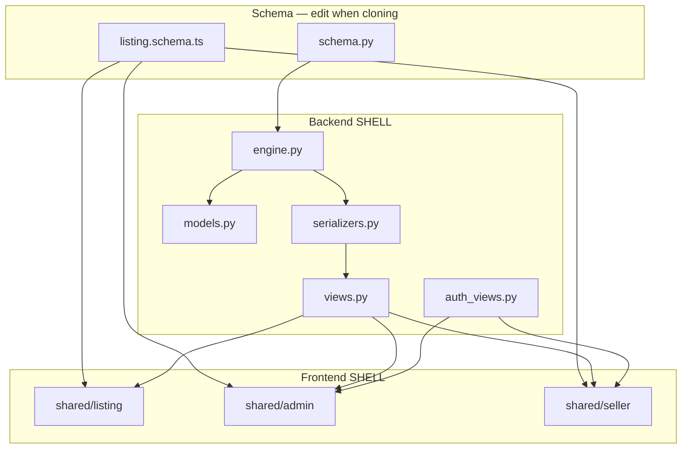
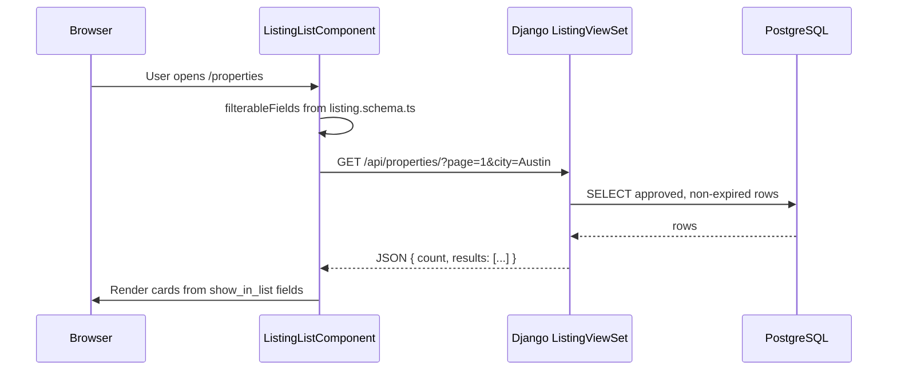
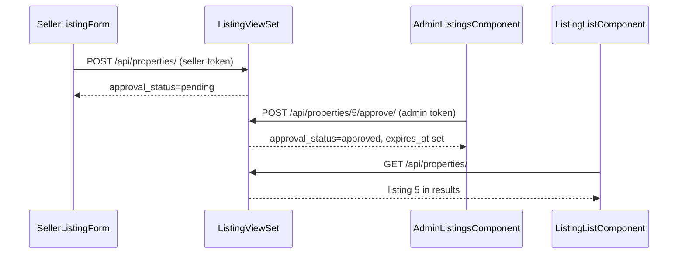

# Code Walkthrough (Junior Developer Guide)

This guide explains **how the project works**, file by file.  
If you just want to run the app → [README.md](./README.md).  
If you are cloning for jobs/cars → [NEW_LISTING_TYPE.md](./NEW_LISTING_TYPE.md).

Every application file has a **header comment** at the top. Functions and important variables have a **purpose comment on the line immediately before** the declaration — read the file top-to-bottom and it should explain itself.

---

## Code comment standard

When reading or editing source files, expect this pattern:

**Python example (`engine.py`):**

```python
# Map one entry from schema["fields"] to a Django model Field instance.
def _django_field(field_spec: dict) -> models.Field:
    # Schema type — string | text | money | integer | choice | url
    field_type = field_spec["type"]
    # When True, field cannot be blank on required string types
    required = field_spec.get("required", False)
```

**TypeScript example (`listing.service.ts`):**

```typescript
// GET /api/{id}/ — converts filters object to Django query params from schema
getListings(filters: Record<string, string | number | undefined> = {}): Observable<PaginatedListings> {
  let params = new HttpParams();
```

| Rule | Detail |
|------|--------|
| **Before functions** | One-line `#` or `//` comment explaining *why* the function exists |
| **Before variables** | Comment when the name alone is not obvious (config values, flags, query builders) |
| **File header** | Module purpose, SHELL vs SCHEMA, architecture role |
| **Skip obvious code** | Do not comment `i += 1`; do comment business rules and schema-driven logic |

Best file to see the full pattern: `backend/features/listing/engine.py`.

---

## Who this is for

You know basic **Python/Django** and **TypeScript/Angular**, but you are new to this repo.  
After reading this, you should understand:

- Why there are only **two files to edit** when changing the product type
- What each file does and how it connects to the rest
- What happens when a user opens the browse page
- How admin approval and lister accounts fit in
- Where to look when something breaks

---

## The big picture in one sentence

**One schema describes your listing fields; the “engine” turns that schema into a database, API, and UI automatically.**

```
schema.py  +  listing.schema.ts  (YOU EDIT — keep them in sync)
              │
              ▼
         engine + shared UI  (SHELL — do not edit when cloning)
              │
              ▼
    PostgreSQL  +  REST API  +  Angular app
```

---

## Architecture layers

| Layer | What it is | Key files |
|-------|------------|-----------|
| **Schema** | Product config (fields, labels, URLs) | `schema.py`, `listing.schema.ts` |
| **Engine** | Builds model/serializer/viewset from schema | `engine.py`, `models.py` |
| **Business logic** | Approval, expiry, auth, permissions | `views.py`, `auth_views.py`, `permissions.py` |
| **API surface** | URL routing, Swagger | `config/urls.py`, `features/listing/urls.py` |
| **Public UI** | Browse, detail, home | `shared/listing/` |
| **Admin UI** | Staff manage + approve | `shared/admin/` |
| **Seller UI** | Lister register, submit, renew | `shared/seller/` |



---

## Two apps, two ports (important!)

| Program | Port | What it is |
|---------|------|------------|
| **Django** (`python manage.py runserver`) | `8000` | Backend API + database access |
| **Angular** (`npm start`) | `4200` (or another if busy) | Website the user sees in the browser |

- Opening `http://localhost:8000/` often shows a **Django 404** — normal. API lives at `/api/properties/`.
- Opening `http://localhost:4200/` shows the **RealtyAI UI**.
- Angular **calls** Django over HTTP. CORS is configured in `backend/config/settings.py`.

---

## The two schema files (source of truth)

| File | Language | Role |
|------|----------|------|
| `backend/features/listing/schema.py` | Python | Backend reads this at startup |
| `frontend/src/app/core/listing.schema.ts` | TypeScript | Frontend reads this at build time |

Both define `LISTING_SCHEMA` with the same keys:

| Key | Example (RealtyAI) | What it controls |
|-----|-------------------|------------------|
| `id` | `"properties"` | API path `/api/properties/`, routes `/properties`, `/admin/properties` |
| `product_name` | `"RealtyAI"` | Header title, Swagger title |
| `labels.singular` | `"Property"` | Detail URL `/property/5` |
| `labels.plural` | `"Properties"` | List URL `/properties` |
| `listing.default_duration_days` | `15` | How long approved listings stay public |
| `home` | headline, … | Landing page text |
| `fields` | title, price, city, … | Database columns + forms + filters |

**Rule:** If you add a field in Python, add the same field in TypeScript, then run `makemigrations` + `migrate`.

---

## Backend file reference

### `backend/config/` — Django project shell

| File | Purpose | Key functions / contents |
|------|---------|--------------------------|
| **`settings.py`** | Django config: DB from `.env`, CORS, REST framework, Swagger | `INSTALLED_APPS` includes `FEATURE_APPS`; `SPECTACULAR_SETTINGS` from `api_docs.py` |
| **`urls.py`** | Root URL table | Mounts `/api/docs/`, `/api/auth/*`, loops `FEATURE_API_INCLUDES` |
| **`features.py`** | Registers listing app | `FEATURE_APPS`, `FEATURE_API_INCLUDES` — do not edit when cloning |
| **`api_docs.py`** | Swagger title/description from schema | `build_spectacular_settings()` reads `product_name`, `id`, `labels.plural` |
| **`wsgi.py` / `asgi.py`** | Server entry points | Standard Django boilerplate |

**Architecture fit:** `settings.py` loads the listing feature; `urls.py` is the front door for all HTTP routes.

---

### `backend/features/listing/schema.py` — ★ EDIT WHEN CLONING

| What | Details |
|------|---------|
| **Purpose** | Single source of truth for product type, labels, home copy, and field definitions |
| **Exports** | `LISTING_SCHEMA` dict |
| **Used by** | `engine.py`, `models.py`, `views.py`, `serializers.py`, `urls.py`, `admin.py`, `listing_config.py`, `api_docs.py` |
| **After changes** | `makemigrations` + `migrate` if `fields` changed |

Each field in `fields[]` supports flags: `search`, `filter` (`exact`/`range`), `sortable`, `show_in_list`, `show_in_detail`, `required`, `choices`, `default`.

---

### `backend/features/listing/engine.py` — schema → Django/DRF

| Function | Purpose |
|----------|---------|
| `_django_field(field_spec)` | Maps schema `type` → Django `CharField`, `DecimalField`, etc. |
| `create_listing_model(schema)` | Builds dynamic `Listing` model: schema fields + system fields (`created_by`, `approval_status`, `expires_at`, timestamps) |
| `serializer_field_names(schema)` | List of API field names for base serializer |
| `create_serializer_class(schema, model)` | Builds `ModelSerializer` with read-only system fields |
| `create_viewset_class(schema, model, serializer)` | Builds `ModelViewSet` with search/filter/ordering from schema flags |
| `ListingPagination` | 12 items per page default |
| `admin_list_display/filter/search_fields` | Django admin columns from schema flags |

**Architecture fit:** This is the code generator. Without it, you would hand-write models and serializers per product.

---

### `backend/features/listing/models.py`

| What | Details |
|------|---------|
| **Purpose** | Exposes the `Listing` model class |
| **Contents** | `Listing = create_listing_model(LISTING_SCHEMA)` — one line |
| **Used by** | Migrations, `views.py`, `serializers.py`, `admin.py` |

---

### `backend/features/listing/serializers.py`

| Function / class | Purpose |
|------------------|---------|
| `ListingSerializerBase` | From `engine.create_serializer_class` |
| `_contact_for_user(user)` | Reads `ListingProfile` for name/email/phone/role |
| `_should_show_contact(obj)` | Contact only on approved, non-expired listings |
| `ListingSerializer` | Adds `lister_name`, `lister_email`, `lister_phone`, `lister_role` method fields |

**Architecture fit:** Public detail page contact block comes from here, not from schema fields.

---

### `backend/features/listing/views.py`

| Method / action | Purpose |
|-----------------|---------|
| `get_queryset()` | Anonymous: approved+live only; lister: own+public; staff: all; `?mine=1`: own only |
| `get_serializer()` | Non-staff cannot write `approval_status` / `expires_at` |
| `perform_create()` | Staff → approved immediately; lister → pending |
| `perform_update()` | Lister edit of approved listing → back to pending |
| `renew` (POST) | Owner/staff resets to pending for re-approval |
| `approve` (POST) | Staff sets approved + `expires_at` |
| `reject` (POST) | Staff sets rejected + optional reason |

**Architecture fit:** All approval/expiry business rules live here, on top of the generic viewset from `engine.py`.

---

### `backend/features/listing/auth_views.py`

| View | Endpoint | Purpose |
|------|----------|---------|
| `AdminLoginView` | POST `/api/auth/admin-login/` | Token for `is_staff` users |
| `AdminLogoutView` | POST `/api/auth/admin-logout/` | Delete token |
| `AdminMeView` | GET `/api/auth/admin-me/` | Current admin info |
| `RegisterView` | POST `/api/auth/register/` | Create lister + `ListingProfile` |
| `ListerLoginView` | POST `/api/auth/login/` | Token for agent/owner |
| `ListerLogoutView` | POST `/api/auth/logout/` | Delete token |
| `ListerMeView` | GET `/api/auth/me/` | Profile name, email, phone |

---

### `backend/features/listing/permissions.py`

| Class | Purpose |
|-------|---------|
| `ListingPermission` | GET public; POST/PUT/DELETE need staff or lister (own objects only) |
| `IsStaffUser` | Approve/reject actions, admin auth views |
| `IsListerUser` | Lister logout/me |

---

### `backend/features/listing/profile_models.py`

| Model | Purpose |
|-------|---------|
| `ListingProfile` | One-to-one with Django `User`; stores `role` (agent/owner), `display_name`, `phone` |

---

### `backend/features/listing/listing_config.py`

| Function | Purpose |
|----------|---------|
| `get_default_listing_duration_days()` | Env `LISTING_DEFAULT_DURATION_DAYS` or schema default (15) |

---

### `backend/features/listing/urls.py`

| What | Details |
|------|---------|
| **Purpose** | Registers DRF router at `/api/{schema.id}/` |
| **Example** | `id: "jobs"` → `/api/jobs/`, `/api/jobs/5/approve/` |

---

### `backend/features/listing/admin.py`

Optional Django admin UI — list columns and filters driven by schema via `engine.admin_*` helpers.

---

### `backend/features/listing/fixtures/listing_seed.json`

Demo seed data for `loaddata`. Include `approval_status` and `expires_at` for public browse to work.

---

### `backend/features/listing/migrations/`

Auto-generated when schema fields change. Do not edit by hand except data migrations (e.g. approve existing rows).

---

## Frontend file reference

### Bootstrap and routing

| File | Purpose |
|------|---------|
| **`main.ts`** | Bootstraps Angular; provides router, HTTP client, `authInterceptor` |
| **`app.component.ts`** | Site header with nav links from `LISTING_SCHEMA` |
| **`app.routes.ts`** | Merges `listingRoutes`, `sellerRoutes`, `adminRoutes` |
| **`environments/environment.ts`** | `apiBaseUrl: http://localhost:8000/api` |

---

### `frontend/src/app/core/listing.schema.ts` — ★ EDIT WHEN CLONING

| Export | Purpose |
|--------|---------|
| `LISTING_SCHEMA` | Mirror of Python schema |
| `ListingField`, `ListingItem` | TypeScript types |
| `listingApiPath()`, `listingListPath()` | URL builders |
| `adminManagePath()`, `accountManagePath()` | Admin/seller manage URLs |
| `filterableFields()`, `sortableFields()` | Browse sidebar helpers |
| `listDisplayFields()`, `detailDisplayFields()` | Card/detail field lists |
| `formatFieldValue()`, `formatItemField()` | Money/choice formatting |
| `listingDefaultDurationDays()` | UI copy for expiry period |
| `canRenewListing()`, `isListingExpired()` | Seller table helpers |

---

### `frontend/src/app/shared/listing/` — public browse (SHELL)

| File | Purpose | Key methods |
|------|---------|-------------|
| **`listing.routes.ts`** | Routes: `/`, `/home`, `/{id}`, `/{singular}/:id` | — |
| **`listing.service.ts`** | HTTP GET to `/api/{id}/` | `getListings()`, `getMyListings()`, `getListing()` |
| **`listing-list.component.ts`** | Browse page with filters, search, pagination | `loadListings()`, `detectLocation()` |
| **`listing-list.component.html`** | Sidebar filters loop `filterFields`; cards loop results | — |
| **`listing-detail.component.ts`** | Single listing + contact block | `loadItem()` |
| **`listing-detail.component.html`** | Detail layout from `detailFields` | — |
| **`listing-home.component.ts`** | Landing hero + featured grid from `schema.home` | loads 4 items on init |

---

### `frontend/src/app/shared/admin/` — staff UI (SHELL)

| File | Purpose |
|------|---------|
| **`admin.routes.ts`** | `/admin/login`, `/admin/{id}`, `/admin/{id}/new`, `/admin/{id}/:id/edit` |
| **`admin-auth.service.ts`** | Login/logout; stores `admin_token` |
| **`admin-auth.interceptor.ts`** | Adds `Authorization: Token …` to all HTTP calls |
| **`admin.guard.ts`** | Blocks manage pages without admin token |
| **`admin-listing.service.ts`** | POST/PUT/DELETE + approve/reject |
| **`admin-login.component.ts`** | Staff login form |
| **`admin-listings.component.ts`** | Table with status tabs, approve/reject buttons |
| **`admin-listing-form.component.ts`** | Schema-driven add/edit form |
| **`admin-listing-form.component.html`** | Loops `formFields` by type (text, choice, number) |

---

### `frontend/src/app/shared/seller/` — lister UI (SHELL)

| File | Purpose |
|------|---------|
| **`seller.routes.ts`** | `/account/login`, `/account/register`, `/account/{id}`, … |
| **`seller-auth.service.ts`** | Register/login; stores `seller_token` |
| **`seller.guard.ts`** | Blocks manage pages without seller token |
| **`seller-listing.service.ts`** | Create/update/delete + renew |
| **`seller-register.component.ts`** | Agent/owner registration |
| **`seller-login.component.ts`** | Lister login |
| **`seller-listings.component.ts`** | "My listings" table with renew |
| **`seller-listing-form.component.ts`** | Submit listing (pending approval message) |
| **`seller-listing-form.component.html`** | Same schema-driven form pattern as admin |

---

## API routes summary

### Swagger / OpenAPI

| URL | Purpose |
|-----|---------|
| `/api/docs/` | Swagger UI |
| `/api/schema/` | OpenAPI JSON |
| `/api/redoc/` | ReDoc |

Settings: `backend/config/api_docs.py` — title follows `schema.py`.

### Auth (same for every product)

| Method | URL | Purpose |
|--------|-----|---------|
| POST | `/api/auth/admin-login/` | Staff login → token |
| POST | `/api/auth/login/` | Lister login → token |
| POST | `/api/auth/register/` | Create agent/owner account |
| GET | `/api/auth/me/` | Current lister profile |

### Listings (path = `/api/{schema.id}/`)

| Method | URL | Who |
|--------|-----|-----|
| GET | `/api/{id}/` | Public (approved + not expired) |
| GET | `/api/{id}/5/` | Public detail |
| POST | `/api/{id}/` | Admin or lister (lister → pending) |
| POST | `/api/{id}/5/approve/` | Admin only |
| POST | `/api/{id}/5/reject/` | Admin only |
| POST | `/api/{id}/5/renew/` | Owner of listing |

---

## Listing lifecycle (approval + expiry)

```
Lister submits  →  pending   (hidden from public)
Admin approves  →  approved  (visible; expires_at = now + 15 days)
Admin rejects   →  rejected  (hidden; reason stored)
After expiry    →  still approved in DB, but public API hides it
Lister renews   →  pending again (needs re-approval)
```

Public `GET /api/{id}/` only returns rows where `approval_status = approved` AND `expires_at >= now`.

---

## User roles

| Role | Created how | Can do |
|------|-------------|--------|
| **Visitor** | — | Browse approved listings |
| **Admin (staff)** | `createsuperuser` | Approve/reject, add listings instantly, edit all |
| **Lister (agent/owner)** | `/account/register` | Submit listings (pending), edit own, renew |

- Admin UI: `/admin/login` → `/admin/{schema.id}`
- Lister UI: `/account/login` → `/account/{schema.id}`
- Tokens in `localStorage`; sent as `Authorization: Token …`

---

## End-to-end: browse page request



| Step | File |
|------|------|
| Route `/properties` | `listing.routes.ts` uses `LISTING_SCHEMA.id` |
| Build HTTP params | `listing.service.ts` loops schema `fields` |
| Render cards | `listing-list.component.html` |
| Format price/choices | `listing.schema.ts` helpers |

---

## End-to-end: lister submit → admin approve → public sees it



---

## Field flags cheat sheet

| Flag | Backend (`engine.py`) | Frontend |
|------|----------------------|----------|
| `search: true` | `SearchFilter` | Search box |
| `filter: "exact"` | `?city=Austin` | Sidebar dropdown/input |
| `filter: "range"` | `?price__gte=100000` | Min/max inputs |
| `sortable: true` | `?ordering=-price` | Sort dropdown |
| `show_in_list: true` | — | Browse cards |
| `show_in_detail: true` | — | Detail page |

---

## Common “where do I look?” map

| Symptom | Likely file |
|---------|-------------|
| Wrong API path | `schema.py` → `id` |
| Wrong frontend URL | `listing.schema.ts` → `id` or `labels.singular` |
| Missing filter on UI | field missing `filter` in **both** schema files |
| Public list empty | all listings `pending` or expired — admin approve |
| CORS error | backend not running, or restart after settings change |
| Explore API | `/api/docs/` |
| Migration error | `makemigrations` + `migrate` after field change |
| Admin login fails | `createsuperuser`, use `/admin/login` |
| 401 on save | not logged in, or wrong token type |
| Contact not on detail | listing not approved/expired; check `serializers.py` |
| Understand a file | read header comment at top of that file |

---

## What NOT to edit when cloning

When turning RealtyAI into JobList, **do not** change:

- `engine.py`, `views.py`, `auth_views.py`, `permissions.py`
- `shared/listing/`, `shared/admin/`, `shared/seller/`
- `config/features.py`

**Do** change only:

1. `backend/features/listing/schema.py`
2. `frontend/src/app/core/listing.schema.ts`

Then migrate if fields changed.

---

## Suggested learning path

1. Read header comments in `schema.py` and `listing.schema.ts`
2. Open `engine.py` → trace `create_listing_model` and `create_viewset_class`
3. Read `views.py` → `get_queryset` and `approve` action
4. Hit `http://localhost:8000/api/properties/` — see raw JSON
5. Open `listing.service.ts` → follow `getListings` to `listing-list.component.ts`
6. Trace approve flow: seller POST → admin approve → public GET shows item
7. Use `/api/docs/` to try endpoints interactively

---

## See also

- [README.md](./README.md) — install and run
- [NEW_LISTING_TYPE.md](./NEW_LISTING_TYPE.md) — clone checklist and jobs example
